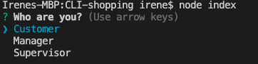
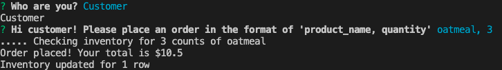
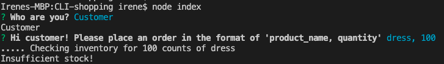
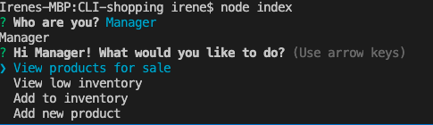
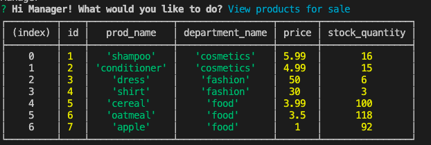
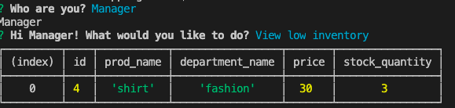
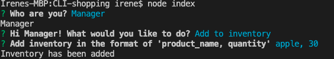
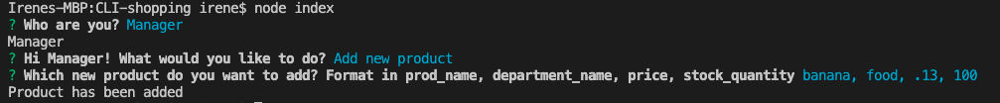
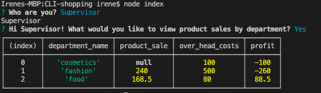

# CLI shopping tool

## On first launch, user picks who they are

- 

## 1. if user chooses customer,

User can place an order. If in inventory, user sees

- 

If out of stock, user sees

- 

## 2. if user chooses manager, user sees 4 options

- 

#### view products for sale

- 

#### view low inventory

- 

#### add to inventory

- 

#### add new product

- 

## 3. if user chooses supervisor, user sees

- 
